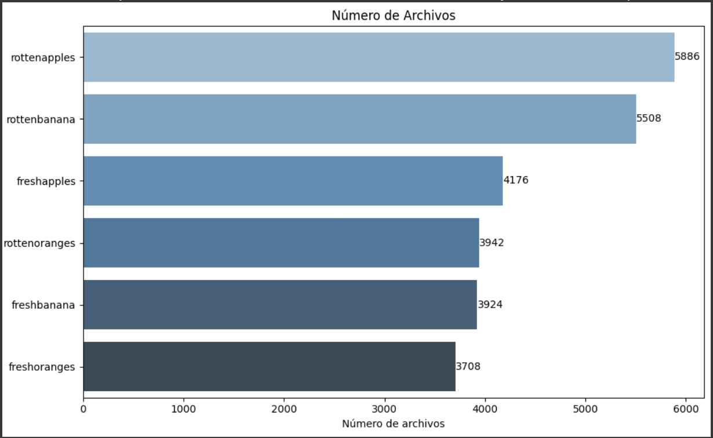
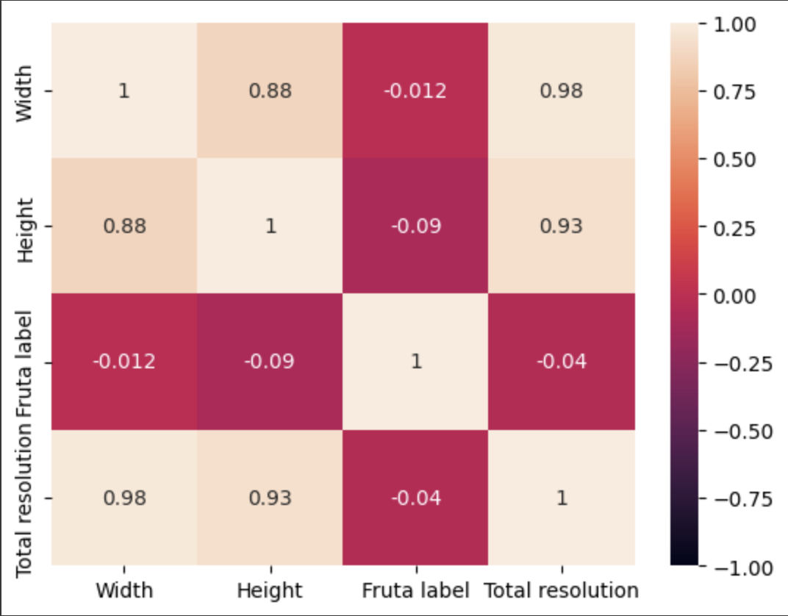
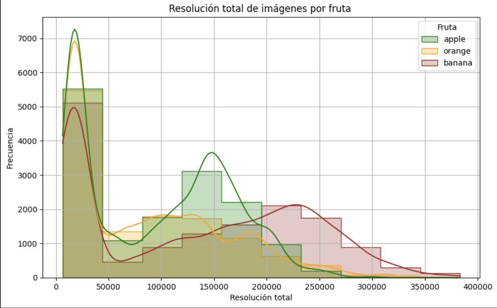

# Reporte de Datos

Se presentan los resultados del análisis exploratorio de los datos.

## Resumen general de los datos

El conjunto de datos trae preestablecido la partición de los mismos en las carpetas `dataset`, `train` y `test`. Sin embargo, como los datos se repiten, se procede a eliminar estos datos repetidos, a demás, se eliminan los datos de una categoria que no esta contemplada dentro del alcance del proyecto.  

Se cuenta con imagenes de bananos, naranjas y manzanas repartidos y organizados en frutas en buen estado y frutas en mal estado, de esta manera se tienen las siguientes variables:

`0    freshapples`  
`1    freshbanana`  
`2   freshoranges`  
`3   rottenapples`  
`4   rottenbanana`  
`5  rottenoranges`  

Las imagenes se encuentran en formato `.png`, se verifica que todas las imagenes puedan ser abiertas, que no hayan imagenes vacias, que no hayan imagenes completamente negras o blancas, por ultimo se verifica la cantidad de imagenes con baja resolución. 

## Resumen de calidad de los datos

Se filtran las imagenes teniendo en cuenta la información minima que puede brindar la imagen al proyecto, segun su tamañano (Resolución 128X128) con un resultado de 27 imagenes que no cumplen esta condición, se procede a hacer la eliminación, ya que no representa un numero significativo respecto al total de imagenes con el que se cuenta.   
De esta manera despues de la limpieza de datos se tiene un total de 10879 imagenes de validacion, que seria un aproximado del 80% de los datos, y 2693 imagenes de prueba, que seria un aproximado del 20% de los datos, todas estas imagenes sin errores, no hay imagenes duplicadas.

## Variable objetivo
La variable objetivo a estimar son dos variables categóricas que el modelo predecirá que son las siguientes:  

- Nombre de la fruta (Banano, Manzana, Naranja)  
- Estado de la fruta (Apta, No Apta)  

Estas variables se predeciran a partir de la imagen que reciba el modelo determinando estas dos variables objetivo.
El producto final será utilizado por parte de los exportadores de fruta que podrán, a través del modelo, identificar si la fruta está en condiciones optimas o no, para ser exportada y evitar posibles contaminaciones, es decir, para este proyecto se tendra en cuenta si es una fruta fresca `fresh` o si es una fruta `rotten` además el modelo debe informar que tipo de fruta es `freshapples`, `freshbanana`, `freshoranges`, `rottenapples`, `rottenbanana`, `rottenoranges`. Esta información etiquetada ya viene preestablecida en el dataset por la manera en que estan almacenados los datos.

| Carpeta, estado y fruta | Número de archivos |
|------|---------|
| train - rottenapples| 2342 | 
| train - freshapples | 1693 | 
| train - rottenbanana | 2224 | 
| train - freshbanana | 1581 | 
| train - rottenoranges | 1573 | 
| train - freshoranges | 1466 |
| test - rottenapples | 601 |
| test - freshapples | 395 |
| test - rottenbanana | 530 |
| test - fresbanana | 381 |
| test - freshoranges | 388 |
| test - rottenorange | 398 |

## Ranking de variables

Para determinar la relación entre variables se tomo como referencia la resolución de cada imagen en el set de imágenes a utilizar. Se utilizan expresiones regulares para poder separar tanto el estado (fresh, unripe, rotten) como el tipo de fruta (apple,  banana, orange) y determinar su frecuencia en el dataset, con el fin de poder saber si hay algún tipo de correlación entre las frutas y la resolución, de esta manera se transforma cada tipo de fruta, a etiqueta numérica por medio de `LabelEncoder()`.  

Como resultado se obtiene que las etiquetas correspondientes a las frutas, no tienen correlación con la resolución de las imágenes. Consecuentemente, esto es un buen indicio sobre el conjunto de datos, al no presentar alguna preferencia de resolución sobre alguna fruta en específico.  

Como resultado se encuentra en que existe una relación fuerte y positiva entre `width` y `Height`, siendo logico, pues al ser imagenes anchas tienden a ser imagenes más altas, de aqui el alto valor de la correlación, similar a la correlación entre `width` Vs `Total resolution`, ya que si aumenta el ancho, la resolución tambien crece. Diferente pasa con `width` o `Height` Vs `Fruta Label`, ya que hay una correlación muy debil y casi nula, indicando que `Fruta label` no esta relacionada con la resolución de la imagen.  

Por ultimo, se evidencia que las imágenes de la fruta banano presentan rangos mayores de resolución, alcanzando valores por encima de los 350000 pixeles mientras que la fruta naranja tiene un máximo de 300000, sin embargo, todos los tres tipos de fruta presentan una mayor densidad hacia imágenes entre los 0 y 50000 pixeles de resolución total.

De esta manera, se evidencia que el conjunto de datos conserva una cantidad suficiente de imágenes para el desarrollo del modelo, además de confirmar que las resoluciones son adecuadas para el fin del proyecto.
